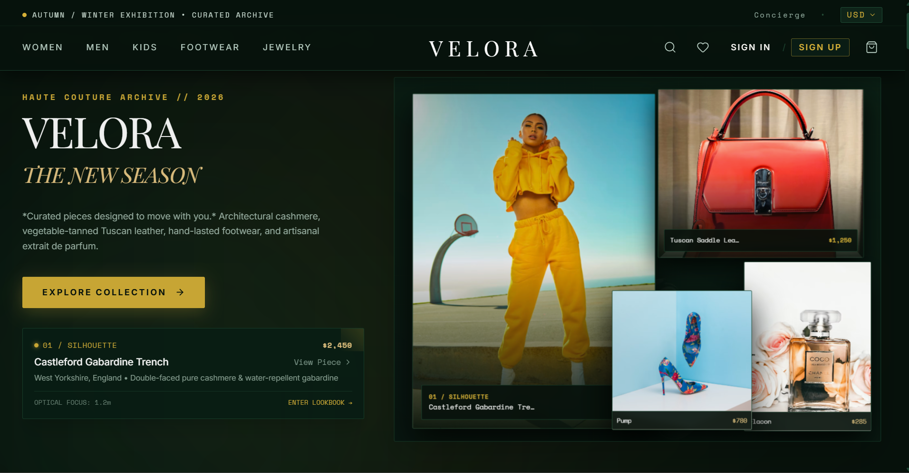

# Velora — Luxury Fashion House

> An editorial, luxury fashion e-commerce experience with curated collections, haute couture tailoring, high-craft footwear, and accessories.

  

**Status: ✅ Complete** — All planned features are implemented and working end-to-end.

## Screenshots



## Overview

Velora is a full-stack e-commerce web app built with React, TypeScript, Tailwind CSS, and Three.js, powered by an Express REST API backed by a JSON-file database. It delivers a complete shopping journey — from editorial product discovery to checkout, order tracking, wishlist, and an admin dashboard — in a polished dark, editorial luxury theme.

## Features

- 🛍️ **Shop & filtering** — browse by category, collection, gender, price range, new/best-seller/featured, plus live search and sort
- 🧵 **Product details** — gallery, size/color selection, quick view, and **3D product turntable showcase** (Three.js)
- 🛒 **Cart & Checkout** — slide-out cart drawer, promo discount, delivery & payment options, order confirmation
- ❤️ **Wishlist** — save and manage favourite pieces
- 👤 **Accounts** — sign in / register (email + Google), session handling, and a personal dashboard with order tracking
- 🛠️ **Admin dashboard** — store metrics, product CRUD, order status management, and DB reset-to-seed
- 🎨 **Editorial experience** — hero 3D stage, lookbook modals, lifestyle collections (Women, Men, Kids, Footwear, Accessories), and a dedicated **Studio 3D** page
- 📱 **Responsive** — fully responsive dark luxury UI with toast notifications and smooth micro-interactions

## Tech Stack

**React 19** · **TypeScript** · **Tailwind CSS 4** · **Vite 6** · **Express** · **Three.js** · **GSAP** · **Motion** · **Lucide**

## Getting Started

```bash
npm install       # install dependencies
npm run dev       # start dev server → http://localhost:3000
npm run build     # production build (Vite + bundled server)
npm start         # run the production build
```

Optional: copy `.env.example` to `.env` and add a `GEMINI_API_KEY` for Gemini-powered API features.

## API Overview

The Express server exposes a REST API under `/api`:

| Endpoint | Description |
| --- | --- |
| `GET /api/products` | Filtered product catalog (category, collection, price, search, sort) |
| `GET /api/products/:id` | Single product |
| `GET /api/categories`, `GET /api/collections` | Catalog metadata |
| `POST /api/orders`, `GET /api/orders` | Create and list orders |
| `POST /api/auth/login`, `/register`, `/google` | Authentication |
| `GET /api/admin/metrics`, `POST/PUT/DELETE /api/admin/products` | Admin management |

## Project Structure

```text
veloura-ecommerce/
├── src/
│   ├── assets/images/   # product & editorial imagery
│   ├── components/      # Header, CartDrawer, SearchModal, modals…
│   ├── context/         # global store state
│   ├── data/            # product, category & collection seed data
│   ├── pages/           # Home, Shop, Product, Cart, Checkout, Dashboard…
│   └── server/          # JSON-file database layer
├── data/
│   └── velora_database.json   # runtime database
├── public/assets/       # static images & 3D cutouts
├── server.ts            # Express API server
├── vite.config.ts
└── package.json
```
